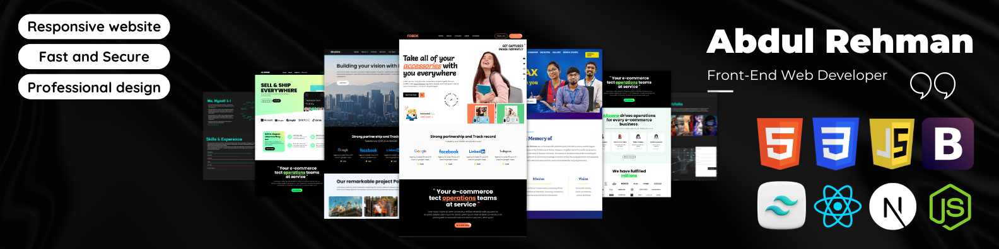

<h1>Hi 👋, I'm Abdul Rehman</h1>
<h3>A Passionate Full-Stack Developer</h3>

  
  

---

## 🚀 About Me:
- 🌱 I’m currently learning **AI/ML** and expanding my **backend development** skills.
- 👨‍💻 I’ve built **social media platforms**, **e-commerce sites**, and **personal portfolios** using modern web technologies.
- 🔭 I’m currently working on **[MERN stack projects]**.
- 📫 Reach me at: **[rehman.contact9@gmail.com]**.

## ⚡️ Skills

## 🌟 My Projects:
- 🛒 **E-commerce Website** - A fully functional online shopping platform using MERN stack.
- 📱 **Social Media Platform** - A feature-rich social network built with React and Node.js.
- 💼 **Personal Portfolio** - My own developer portfolio showcasing my work and skills.

[Check out more of my projects on GitHub!](https://github.com/rehmanNRY?tab=repositories)

---

## 📊 GitHub Stats:

 

<!-- first row -->
  

  <!-- streak stats -->
    <a href="https://github.com/denvercoder1/github-readme-streak-stats" title="Go to Source">
      <picture>
        <source media="(prefers-color-scheme: dark)" srcset="https://github-readme-streak-stats.herokuapp.com/?user=rehmanNRY&theme=react&hide_border=true" />
        <source media="(prefers-color-scheme: light), (prefers-color-scheme: no-preference)" srcset="https://github-readme-streak-stats.herokuapp.com/?user=rehmanNRY&theme=default&border=61dafb" />
        
      </picture>
    </a>
  <!-- github stats -->
    <a href="https://github.com/anuraghazra/github-readme-stats" title="Go to Source">
      <picture>
        <source media="(prefers-color-scheme: dark)" srcset="https://github-readme-stats.vercel.app/api?username=rehmanNRY&show_icons=true&theme=react&hide_border=true" />
        <source media="(prefers-color-scheme: light), (prefers-color-scheme: no-preference)" srcset="https://github-readme-stats.vercel.app/api?username=rehmanNRY&show_icons=true&theme=default&border_color=61dafb" />
        
      </picture>
    </a>
  

  <!-- spaces -->
         
  <!-- contribution graph -->
  <a href="https://github.com/Ashutosh00710/github-readme-activity-graph" title="Go to Source">
    <picture>
      <source media="(prefers-color-scheme: dark)" srcset="https://github-readme-activity-graph.vercel.app/graph?username=rehmanNRY&theme=react-dark" />
      <source media="(prefers-color-scheme: light), (prefers-color-scheme: no-preference)" srcset="https://github-readme-activity-graph.vercel.app/graph?username=rehmanNRY&bg_color=ffffff&color=708090&line=24292e&point=24292e&area=true&hide_border=true" />
      
    </picture>
  </a>

<!-- repositories -->
<h2 align="center" style="font-size: 100px;">👨‍💻 Repositories 👨‍💻</h2>
 
<!-- first row -->

  <!-- repo 1 -->
  <a href="https://github.com/rehmanNRY/SocialMediaApp" title="Social Media app" style="flex: 1 1 45%;">
    <picture>
      <source media="(prefers-color-scheme: dark)" srcset="https://github-readme-stats.vercel.app/api/pin/?username=rehmanNRY&repo=SocialMediaApp&theme=react&border_color=61dafb&border_radius=10" />
      <source media="(prefers-color-scheme: light)" srcset="https://github-readme-stats.vercel.app/api/pin/?username=rehmanNRY&repo=SocialMediaApp&theme=graywhite&border_radius=10" />
      
    </picture>
  </a>
  <!-- repo 2 -->
  <a href="https://github.com/rehmanNRY/ResearchHub" title="ResearchHub App" style="flex: 1 1 45%;">
    <picture>
      <source media="(prefers-color-scheme: dark)" srcset="https://github-readme-stats.vercel.app/api/pin/?username=rehmanNRY&repo=ResearchHub&theme=react&border_color=61dafb&border_radius=10" />
      <source media="(prefers-color-scheme: light)" srcset="https://github-readme-stats.vercel.app/api/pin/?username=rehmanNRY&repo=ResearchHub&theme=graywhite&border_radius=10" />
      
    </picture>
  </a>

  <!-- repo 1 -->
  <a href="https://github.com/rehmanNRY/SocialMediaApp" title="Social Media app" style="flex: 1 1 45%;">
    <picture>
      <source media="(prefers-color-scheme: dark)" srcset="https://github-readme-stats.vercel.app/api/pin/?username=rehmanNRY&repo=SocialMediaApp&theme=react&border_color=61dafb&border_radius=10" />
      <source media="(prefers-color-scheme: light)" srcset="https://github-readme-stats.vercel.app/api/pin/?username=rehmanNRY&repo=SocialMediaApp&theme=graywhite&border_radius=10" />
      
    </picture>
  </a>
  <!-- repo 2 -->
  <a href="https://github.com/rehmanNRY/ResearchHub" title="ResearchHub App" style="flex: 1 1 45%;">
    <picture>
      <source media="(prefers-color-scheme: dark)" srcset="https://github-readme-stats.vercel.app/api/pin/?username=rehmanNRY&repo=ResearchHub&theme=react&border_color=61dafb&border_radius=10" />
      <source media="(prefers-color-scheme: light)" srcset="https://github-readme-stats.vercel.app/api/pin/?username=rehmanNRY&repo=ResearchHub&theme=graywhite&border_radius=10" />
      
    </picture>
  </a>

      
---

## 🔗 Connect with Me:
- 💼 [LinkedIn](https://www.linkedin.com/in/rehman-nry)
- 📸 [Instagram](https://www.instagram.com/rehman_nry/)
- 🌐 [Personal Portfolio](https://rehman-nry.netlify.app/)

  
  
  

